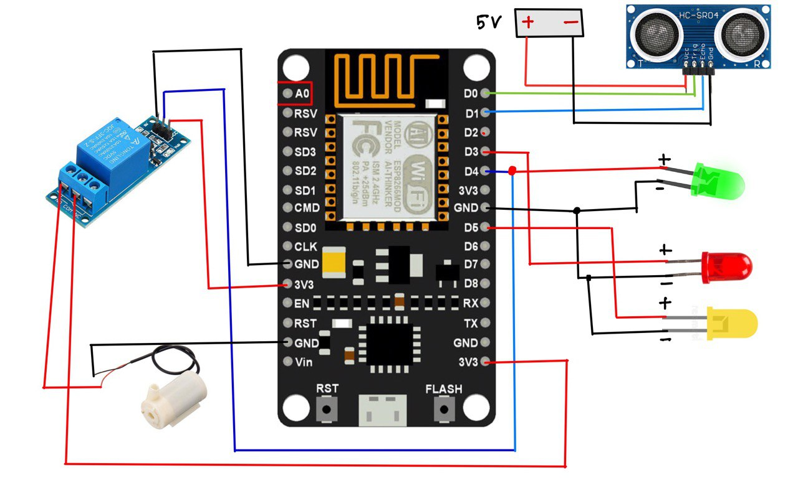

# Water Level Monitoring System

This project, developed for CSE 250 (Project II), introduces an innovative solution for monitoring liquid levels using Internet of Things (IoT) technology. The system is designed to alert users about potential issues such as liquid overflow or depletion in a tank. It incorporates an ultrasonic sensor to accurately measure the water level and percentage in the tank. The associated mobile application provides users with the ability to monitor and control the entire system, including the option to turn the water pump on or off. Additionally, different colored LED lights are employed to visually indicate the water level in the tank.

## Components Required

- **NodeMCU ESP8266**
- **5V Relay Module**
- **Wire**
- **3-6V Submersible Water Pump**
- **Tube**
- **Breadboard**
- **Ultrasonic Sonar Sensor HC-SR04**
- **5V Power Source**

## Project Goals

1. **Water Conservation:** Eliminate water wastage during the tank refilling process.
2. **Simplified Maintenance:** Reduce the hassle of regularly monitoring and maintaining the water level in the tank.

## Setup Instructions

1. Connect the Ultrasonic Sonar Sensor HC-SR04 to the NodeMCU ESP8266 using wires.
2. Connect the 5V Relay Module to the NodeMCU ESP8266 to control the submersible water pump.
3. Attach the submersible water pump to the water tank using a tube.
4. Set up the breadboard to organize the connections neatly.
5. Power the system with a 5V power source.
   

## Usage

1. Install the mobile application provided with the system.
2. Monitor the water level and percentage through the intuitive mobile interface.
3. Use the mobile application to control the water pump, turning it on or off as needed.
4. Observe the different colored LED lights to quickly assess the water level in the tank.

[System Overview Video](https://youtu.be/wzdb5dMC9Hk)

By following these instructions, you can implement an efficient water level monitoring system that contributes to water conservation and simplifies the maintenance of your water tank.

## Disclaimer

This project is for educational purposes and may require adherence to local regulations regarding water systems and IoT devices. Please ensure compliance with applicable laws and standards before implementation.

